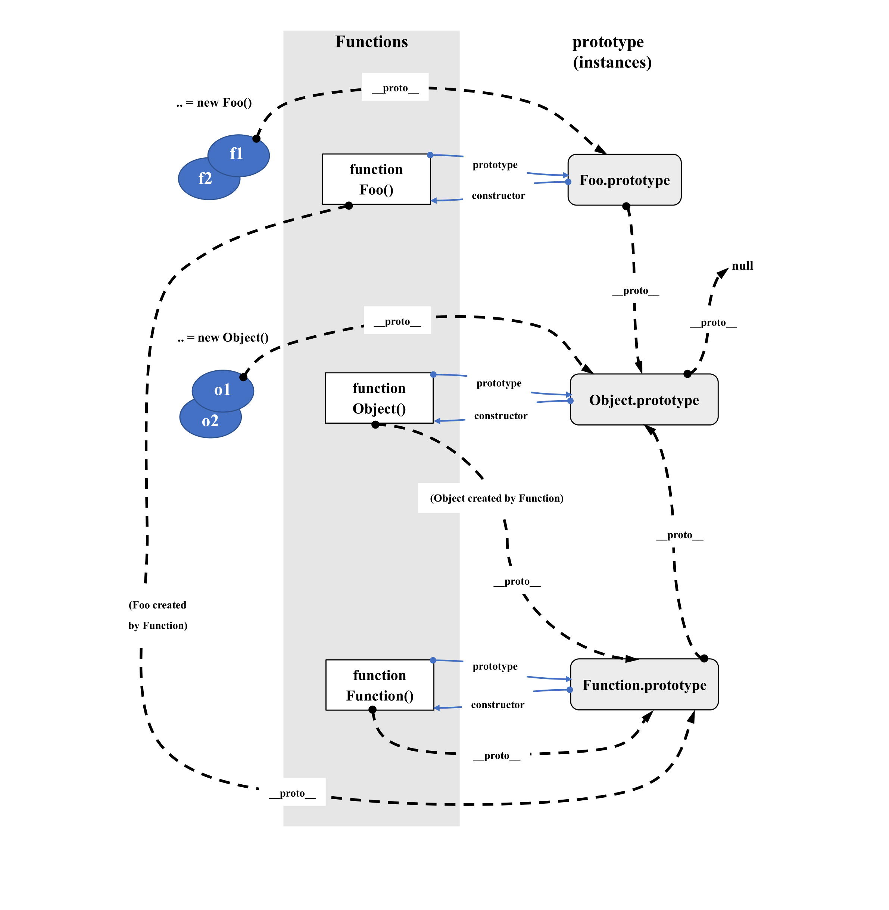
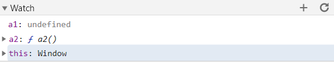
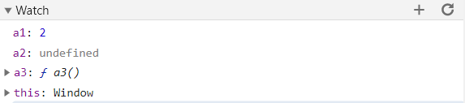
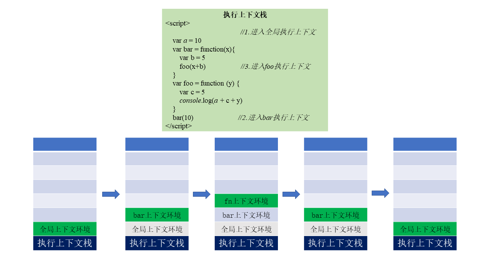
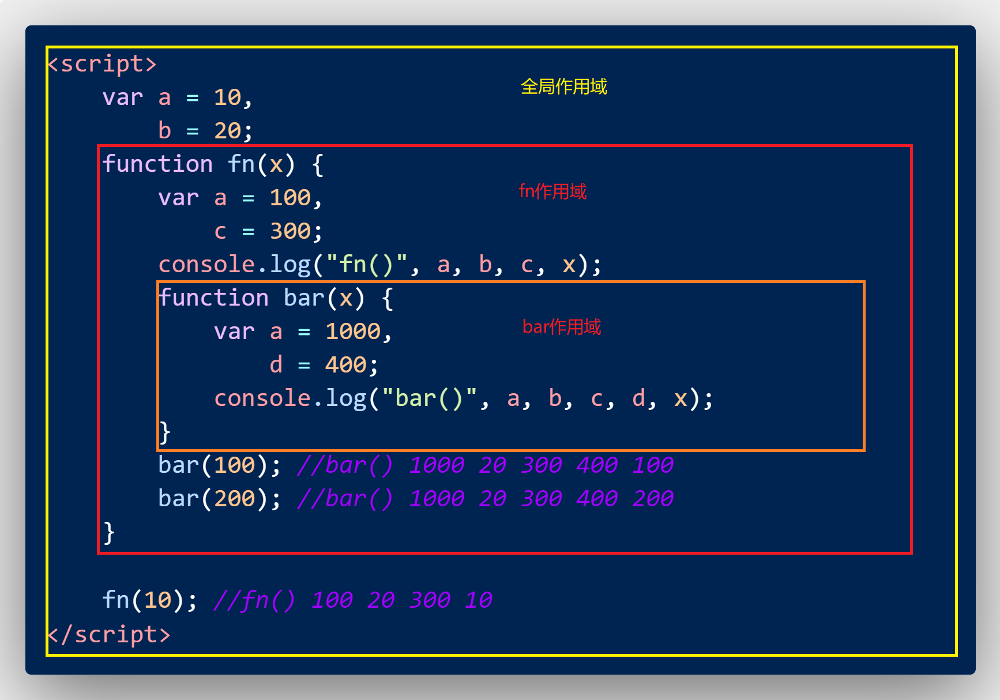
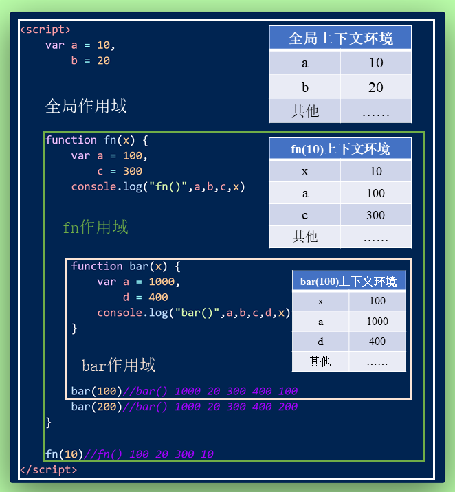

#   js高级
--------

##  函数高级

### 原型

  - 每个函数都有一个prototype属性，它默认指向一个Object空对象（即原型对象）
  - 原型对象中有一个属性constructor，它指向原函数对象
  - 给原型对象添加属性（一般是方法）
    >作用：函数的所有实例对象自动拥有原型中的属性方法
  - **显示原型与隐式原型**
    - 每个函数都有一个prototype，即显示原型
    - 每个实例对象都一个\_\_proto\_\_，即隐式原型
    - 对象的隐式原型的值为其对应构造函数的显示原型的值
    
    ```javascript

        function Fun() {//函数创建的时候即生成prototype属性
            // 内部语句：this.prototype = {}
    
        }
        var f1 = new Fun()//内部语句：this.__proto__ = Fun.prototype
    
        // 每个实例对象都一个__proto__，即隐式原型
        console.log(f1.__proto__)//{constructor: ƒ}
    
        // 对象的隐式原型的值为其对应构造函数的显示原型的值
        console.log(Fun.prototype===f1.__proto__)//true

    ```
    
  - 总结：
    - 函数的prototype属性：在定义函数时自动添加的，默认值是一个空Object对象
    - 对象的\_\_proto\_\_属性：创建对象时自动添加的，默认值为构造函数的prototype
    - 程序员能直接操作显示原型，但不能操作隐士原型（ES6之前）

    

--------

### 原型链

####  原型链图解

- 访问一个对象的属性时，先在自身属性中查找，找到返回
- 如果没有，再沿着**\_\_proto\_\_**这条链向上查找，找到返回
- 如果最终没有找到，返回**undefined**
- 别名：隐式原型链
- 作用：查找对象的属性
- 函数的显示原型指向的对象：默认是空Object实例对象；但是Object函数不满足
- Function是它自身的实例
- Object的原型对象是原型链的尽头
  
 ```javascript

    console.log(Object.prototype)
    function Fn () {
        this.test1 = function(){
            console.log('test1')
        }
    }

    console.log(Fn.prototype)

    Fn.prototype.test2 = function () {
        console.log('test2')
    }
    var fn = new Fn()
    fn.test1()
    fn.test2()
    console.log(fn.toString())

    // 函数的显示原型指向的对象：默认是空Object实例对象；但是Object函数不满足
    console.log(Fn.prototype instanceof Object)//true
    console.log(Object.prototype instanceof Object)//false
    console.log(Function.prototype instanceof Object)//true

    // Function是它自身的实例
    console.log(Function.__proto__ === Function.prototype)//true
    // Object的原型对象是原型链的尽头
    console.log(Object.prototype.__proto__)//null
    
 ```

   

####  探索instanceof

- A instanceof B
- 如果B函数的显式原型对象在A对象的原型链上，返回true，否则返回false

    

    ```javascript
    /*案例1*/
    function Foo() {

    }
    var f1 = new Foo()
    console.log(f1 instanceof Foo)//true
    console.log(f1 instanceof Object)//true

    console.log('----------------')
    /*案例2*/
    console.log(Object instanceof Function)//true
    console.log(Object instanceof Object)//true
    console.log(Function instanceof Function)//true
    console.log(Function instanceof Object)//true
    
    function Fun() {
        
    }
    console.log(Object instanceof Fun)//false
    ```

--------

### 执行上下文与执行上下文栈

1.  变量提升

        通过var定义(声明)的变量，在定义语句之前就可以访问到；
        值：undefined

2.  函数提升

        通过function声明的函数，在此之前就可以直接调用
        值：函数定义（对象）
3.  问题：变量提升和函数提升是如何产生的？

        代码编译之后，var声明的变量就已经定义好了，但是未被赋值，因此变量提升值为undefined；
        function函数在编译阶段就已经在window中生成了该方法；因此在全局中任意位置都可以调用；

####  执行上下文
1.  全局执行上下文

    - 在执行全局代码前，将window确定为全局执行上下文
    - 对全局数据进行预处理
      - var定义的全局变量==>undefined，添加为window属性
      - function声明的全局函数==>赋值(fun)，添加为window方法
      - this==>赋值(window)
    - 开始执行全局代码  添加为执行上下文的属性
    

2.  函数执行上下文

    - 在调用函数，准备执行函数体之前，创建创建对应的函数执行上下文对象
    - 对局部数据进行预处理
      - 形参变量(函数中的局部变量)==>赋值(实参)==>添加为执行上下文的属性
      - arguments==>赋值(实参列表)
      - var定义的局部变量==>，添加为执行上下文的属性
      - function声明的函数==>赋值(fun)，添加为执行上下文的方法
      - this==>赋值(调用函数的对象)
     - 开始执行函数体代码

    ```javascript
    /*全局执行上下文*/
    console.log(a1)//undefined
    console.log(a2)//ƒ a2() {}
    console.log(this)//window
    var a1 = 3
    function a2() {
      
    }
    
    ```

    

    ```javascript
    /*函数体执行上下文*/
    fn(2,3)//

    function fn(a1) {
        console.log(a1)//2
        console.log(a2)//undefined
        a3()//a3()
        console.log(this)//window
        console.log(arguments)//[2,3]
        var a2 = 3
        function a3(){
            console.log("a3()")
        }
    }
    ```

    

####  执行上下文栈

1.  在全局代码执行前，js引擎就会创建一个栈来存储管理所有执行上下文对象
2.  在全局执行上下文(window)确定后，将其添加到栈中(压栈)
3.  在函数执行上下文创建后，将其添加到栈中(压栈)
4.  在当前函数执行完后，将栈顶的对象移除(出栈)
5.  当所有代码执行完后，栈中只剩下window

    ```javascript
    <script>
                                    //1.进入全局执行上下文
    var a = 10
    var bar = function(x){
        var b = 5
        foo(x+b)                    //3.进入foo执行上下文
    }
    
    var foo = function (y) {
        var c = 5
        console.log(a + c + y)
    }
    bar(10)                         //2.进入bar执行上下文
    </script>
    
    ```

    
  
--------

### 作用域与作用域链

####  作用域
- 作用域是静态的（相对于上下文对象），在编码时就确定了
- 分类
  - 全局作用域
  - 函数作用域
  - 块作用域（只有ES6中有）
- 作用：隔离变量，不同作用域下同名变量不会有冲突

  
####  作用域与执行上下文之间的区别和联系

1.  区别1：
  -   全局作用域之外，每个函数都会创建自己的作用域，作用域在函数定义时就已经确定了，而不是在函数调用时
  -   全局执行上下文环境是在全局作用域确定之后，js代码即将执行之前创建
  -   函数执行上下文环境是在调用函数时，函数体代码执行之前创建


2.  区别2：
  -   作用域是静态的，只要函数定义好了就一直存在，且不会再变化
  -   上下文环境是动态的，调用函数时创建，函数调用结束时上下文环境就会被释放


3.  联系：
  -   上下文环境（对象）是从属于所在的作用域
  -   全局上下文环境==>全局作用域
  -   函数上下文环境==>对应的函数作用域

  

--------

### 闭包

####  闭包相关

1.  如何产生闭包
    
    - 当一个嵌套的内部子函数引用了嵌套外部的外部父函数的变量时，就产生了闭包

2.  闭包到底是什么？
    
    - 使用chrome调试查看
    - 理解1：闭包是嵌套的内部函数
    - 理解2：闭包包含被引用变量（函数）的对象
    - 闭包存在于嵌套的内部函数中

3.  产生闭包的条件

    - 函数嵌套
    - 内部函数引用了外部函数的数据

####  常见的闭包
1.  将函数作为另一个函数的返回值

  ```javascript
    function fn1() {
        var a = 2
        function fn2() {
            a++
            console.log(a)
        }

        return fn2
    }
    var f = fn1()
    f()//3
    f()//4
  ```

2.  将函数作为实参传递给另一个函数调用

  ```javascript
    function showDelay(msg,time){
        setTimeout(funtion(){
            alert(msg)
        },time)
    }

    showDelay("123",3000)
  ```

####  闭包的作用

1.  使函数内部的变量，在函数执行完毕后，仍然存在于内存中
2.  让函数外部可以操作到函数内部的数据

**问题：**
1.  函数执行完后，函数内部声明的局部变量是否还存在？

    >一般不存在,存在于闭包中的变量才可能存在

2.  在函数外部能直接访问函数内部的局部变量吗？

    >不能,但是通过闭包，可以让外部操作它
    
####  闭包的生命周期

产生：在嵌套内部函数定义执行完时就产生了（不是在调用的时候）
死亡：在嵌套内部函数成为垃圾对象时死亡

  ```javascript
    function fn1() {

        //此时闭包就已经产生了，（函数提升，内部函数对象已经创建了）
        var a = 2
        function fn2() {
            a++
            console.log(a)
        }

        return fn2
    }
    var f = fn1()//
    f()//3
    f()//4

    f = null;//闭包死亡

  ```

####  闭包的应用

  闭包的应用：定义js模块
  -   具有特定功能的js模块
  -   将所有的数据和功能都封装在一个函数内部（私有的）
  -   只向外暴露一个包含n个方法的对象或函数
  -   模块的使用者，只需要通过模块暴露的对象调用方法来实现对应的功能
  -   没有返回值，使用IFEE，将方法设置为window对象属性，在代码中可以直接调用


  ```javascript
    (function(){
     var msg = "message"
     function doSomething() {
          console.log("doSomething()"+msg.toUpperCase())
      }
      
      function doOtherthing() {
          console.log("doOtherthing()"+msg.toLowerCase())
      }
  
      window.myModule2 = {
          doSomething:doSomething,
          doOtherthing:doOtherthing
      }
    })()
  ```
- 返回值为对象


```javascript
  function myModule() {
    var msg = "message"
    function doSomething() {
        console.log("doSomething()"+msg.toUpperCase())
    }
    
    function doOtherthing() {
        console.log("doOtherthing()"+msg.toLowerCase())
    }

    return {
        doSomething:doSomething,
        doOtherthing:doOtherthing
    }
  }
```

####  缺点
- 函数执行完后，函数内的局部变量没有哦释放，占用内存时间会边长
- 容易造成**内存泄漏**（内存被占用没有释放）
    **解决**
    - 能不用闭包就不用
    - 及时释放

  **内存溢出**
  - 一种程序运行出现的错误
  - 当程序运行需要的内存超过了剩余的内存时，就会抛出内存溢出的错误
  
  
  **内存泄漏**
  - 占用的内存没有释放
  - 内存泄漏积累多了就容易导致内存溢出
  - 常见的内存泄漏
    - 意外的全局变量
    - 没有及时清理的计时器或回调函数
    - 闭包


--------

##  原型链的继承

1.  套路
  - 定义父类型的构造函数
  - 给父类型的原型添加方法
  - 定义子类型的构造函数
  - 创建父类型对象赋值给子类型的原型
  - 将子类型原型的构造属性设置为子类型
  - 给子类型原型添加方法
  - 创建子类型的对象

2.  关键

  - **子类型的原型为父类型的一个实例对象**