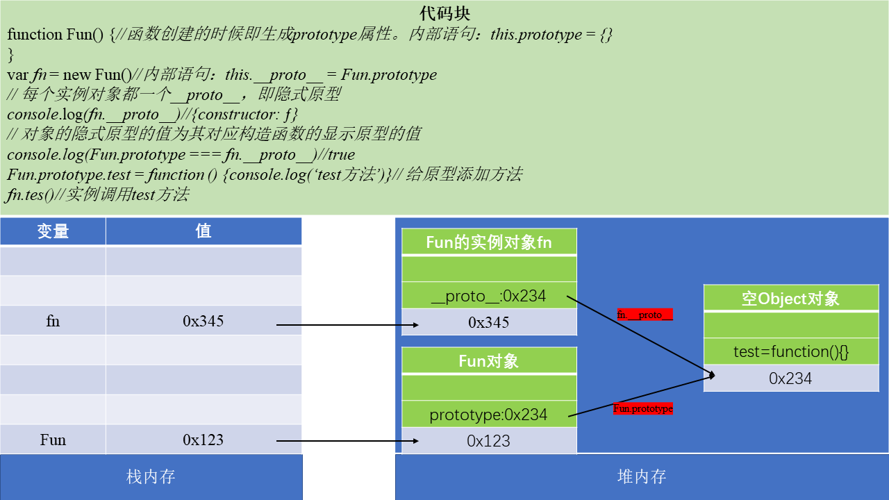
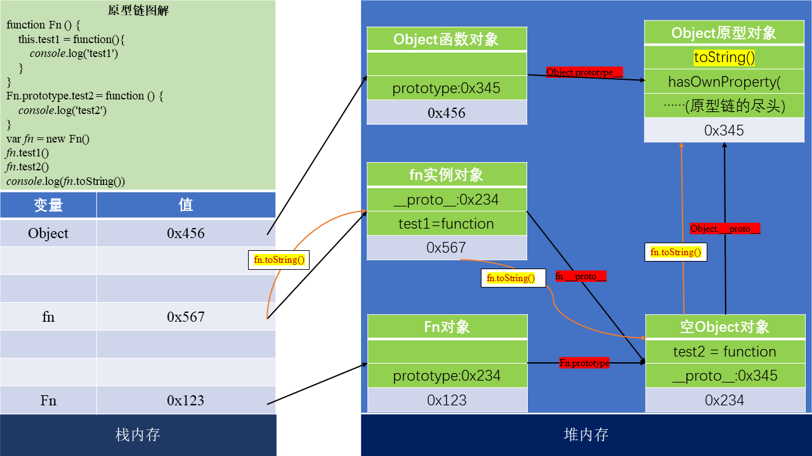

#   js高级
--------

##  函数高级

### 原型

  - 每个函数都有一个prototype属性，它默认指向一个Object空对象（即原型对象）
  - 原型对象中有一个属性constructor，它指向原函数对象
  - 给原型对象添加属性（一般是方法）
    >作用：函数的所有实例对象自动拥有原型中的属性方法
  - **显示原型与隐式原型**
    - 每个函数都有一个prototype，即显示原型
    - 每个实例对象都一个__proto__，即隐式原型
    - 对象的隐式原型的值为其对应构造函数的显示原型的值
    
    ````javascript
        function Fun() {//函数创建的时候即生成prototype属性
            // 内部语句：this.prototype = {}
    
        }
        var f1 = new Fun()//内部语句：this.__proto__ = Fun.prototype
    
        // 每个实例对象都一个__proto__，即隐式原型
        console.log(f1.__proto__)//{constructor: ƒ}
    
        // 对象的隐式原型的值为其对应构造函数的显示原型的值
        console.log(Fun.prototype===f1.__proto__)//true

    
  - 总结：
    - 函数的prototype属性：在定义函数时自动添加的，默认值是一个空Object对象
    - 对象的\_\_proto\_\_属性：创建对象时自动添加的，默认值为构造函数的prototype
    - 程序员能直接操作显示原型，但不能操作隐士原型（ES6之前）

    

--------

### 原型链

####  原型链图解

- 访问一个对象的属性时，先在自身属性中查找，找到返回
- 如果没有，再沿着**\_\_proto\_\_**这条链向上查找，找到返回
- 如果最终没有找到，返回**undefined**
- 别名：隐式原型链
- 作用：查找对象的属性
- 函数的显示原型指向的对象：默认是空Object实例对象；但是Object函数不满足
- Function是它自身的实例
- Object的原型对象是原型链的尽头
  
 ````javascript

    console.log(Object.prototype)
    function Fn () {
        this.test1 = function(){
            console.log('test1')
        }
    }

    console.log(Fn.prototype)

    Fn.prototype.test2 = function () {
        console.log('test2')
    }
    var fn = new Fn()
    fn.test1()
    fn.test2()
    console.log(fn.toString())

    // 函数的显示原型指向的对象：默认是空Object实例对象；但是Object函数不满足
    console.log(Fn.prototype instanceof Object)//true
    console.log(Object.prototype instanceof Object)//false
    console.log(Function.prototype instanceof Object)//true

    // Function是它自身的实例
    console.log(Function.__proto__ === Function.prototype)//true
    // Object的原型对象是原型链的尽头
    console.log(Object.prototype.__proto__)//null
 ````

   

####  构造函数/原型/实例对象的关系（图解）


--------

### 执行上下文与执行上下文栈


--------

### 作用域与作用域链


--------

### 闭包


--------