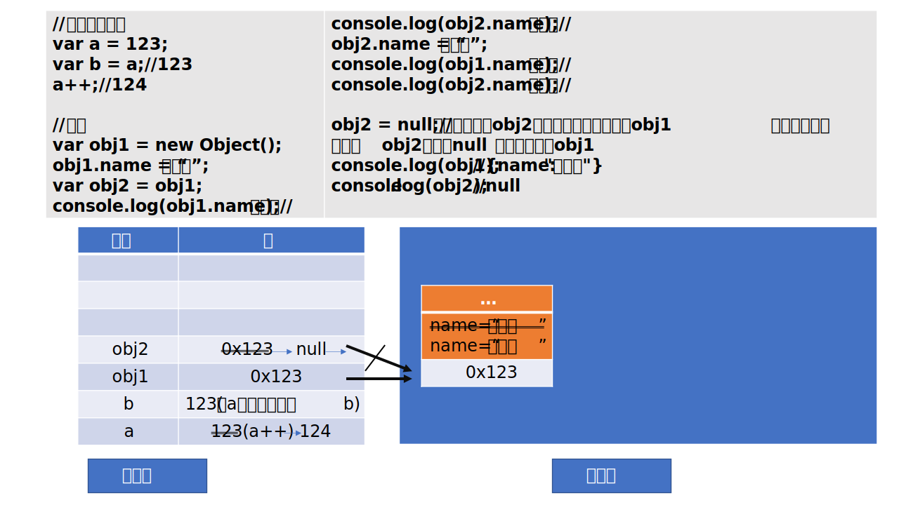
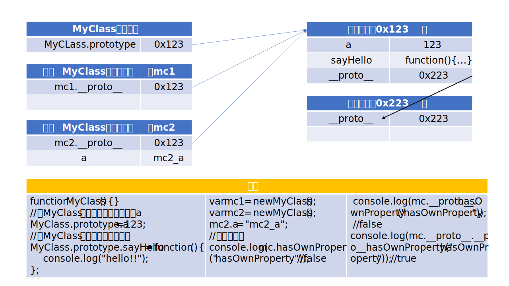
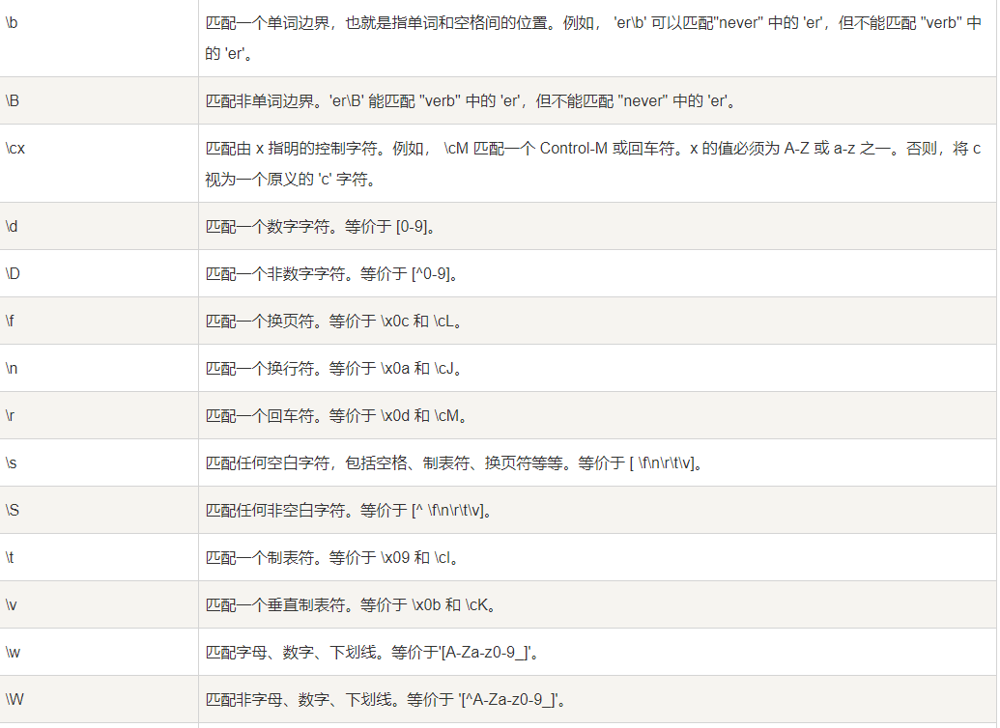

<!--
 * @Brief:
 * @LastEditors: Please set LastEditors
 * @LastEditTime: 2020-08-20 12:51:00
-->

# Javascript 基础部分(常用关键点)

## 一个完整的 js 实现应该由以下三个部分构成

> ECMAScript:js 编码规范(标准)
> DOM：提供一组对象可以操作网页
> BOM：提供一组对象可以操作浏览器

## 怎么取 body 的结点

> var bodyNode = document.body;

## 怎么取 html 的结点

> var htmlNode = document.documentElement;

## js 代码编写位置

> 标签的 onclick 属性中:

```javascript
	onclick="alert();"
	a 标签的 href 属性值中;
	 href = "javascript:alert()";
	从外部引入 js 文件
	<script src="model.js"></script>
```

> 在<head>元素中编写 js 代码:

## js 的数据类型：

### 基本数据类型

> String
> Number
> Boolean
> Null
> Undefined

### 引用数据类型

> Object

## 强制类型转换

### 其他类型转换为 String 类型

#### 调用被转换数据类型的 toString()方法

> > Number 转换为 String
> >
> > > var a = 123;// a 调用该方法不会改变 a 的值，它会将结果返回
> > > a = a.toString();//将 a.toString()赋值给 a 就可改变 a 的类型。
> > > console.log(typeof a);//String
> > > console.log(a);//"123"

> > Boolaen 转换为 String
> >
> > > var b = true;
> > > b = b.toString();
> > > console.log(typeof b);//String
> > > console.log(b);//"true"

> > Null/Undefined 转换为 String
> > Null/Undefined 没有 toString()方法

#### 调用 String()函数,对于 Number 类型 和 Boolean 类型而言，实际上调用的还是 toString()方法，因为针对 Number 类型和 Boolean 类型的 String 类型转换， String()函数的底层就是由 toString()方法实现；但是对于 NUll 和 Undefined 类型就不会调用 toString()方法，他会将 null 直接转换为“null”，将 undefined 转换为“undefined”；

> > //Number 转换为 String
> >
> > > var e = 123;
> > > e = String(e);//e 调用该方法不会改变 e 的值，它会将结果返回;将 String(e)赋值给 e 就可改变 e 的类型。
> > > console.log(typeof e);//String

> > Boolean 转换为 String
> >
> > > var f = true;
> > > f = String(f);
> > > console.log(typeof f); //String
> > > console.log(f);//"true"

> > //null 转为 String
> >
> > > var c = null;
> > > // c = c.toString(); //报错，null 值没有 toString()方法
> > > //使用 String（）函数
> > > c = String(c);
> > > console.log(typeof c); //String
> > > console.log(c); //"null"

> > //undefined 转换为 String
> >
> > > var d = undefined;
> > > // d = d.toString(); //报错，undefined 没有 toString()方法；
> > > // 调用 String()函数
> > > d = String(d);
> > > console.log(typeof d); //String
> > > console.log(d); //"undefined"

#### // 加空字符串""转换为 String

> > > // null 转换为 String
> > > var g = null;
> > > g = g + "";
> > > console.log(typeof g); //String
> > > console.log(g); //"null"

> > > // undefined 转换为 String
> > > var h;
> > > h = h + "";
> > > console.log(typeof h); //String
> > > console.log(h); //"undefined"

> > > // Number 转换为 String
> > > var i = 123;
> > > i = i + "";
> > > console.log(typeof i); //String
> > > console.log(i); //"123"

> > > // Boolean 转换为 String
> > > var j = false;
> > > j = j + "";
> > > console.log(typeof j); //String
> > > console.log(j); //"false"

### 其他类型转换为 Number

#### 使用 Number()函数

```javascript
//将String类型转换为Number
var a = "123";
console.log(a); //"123"
console.log(typeof a); //String

a = Number(a);
console.log(a); //123
console.log(typeof a); //Number

//当String值含有任何非Number型字符，强转到Number类型时，a就会赋值成NaN
a = "123*";
a = Number(a);
console.log(a); //NaN : Not a Number
console.log(typeof a); //Number

// 字符串为空串或全空格字符串
console.log("a是空字符串");
a = "   ";
a = Number(a);
console.log(a); //0
console.log(typeof a); //Number

a = "";
a = Number(a);
console.log(a); //0
console.log(typeof a); //Number

// 将Boolean转换为Number
a = true;
a = Number(a);
console.log(a); //1
console.log(typeof a); //Number

a = false;
a = Number(a);
console.log(a); //0
console.log(typeof a); //Number

//将Null转换为Number
a = null;
a = Number(a);
console.log(a); //0
console.log(typeof a); //Number

//将Undefined转换为Number
a = undefined;
a = Number(a);
console.log(a); //NaN : Not a Number
console.log(typeof a); //Number
```

#### 使用 parseInt()和 parseFloat()函数

```javascript
/*
            转换方式2:这种方式专门用来对付字符串
                函数：
                parseInt();把一个字符串转换为整型
                parseFloat();把一个字符串转换为浮点数
        */
// 将具有非数值型的字符串转换为Number类型
console.log("-------");
a = "123px";
a = parseInt(a);
console.log(a); //123
console.log(typeof a); //Number

a = "123.123abc";
a = parseInt(a);
console.log(a); //123
console.log(typeof a); //Number

a = "123.123abc";
a = parseFloat(a);
console.log(a); //123.123
console.log(typeof a); //Number

a = "123.123.123abc";
a = parseFloat(a);
console.log(a); //123.123
console.log(typeof a); //Number

// parseInt()和parseFloat()函数只解析到非数字型字符为止
a = "12abc3.123";
a = parseInt(a);
console.log(a); //12
console.log(typeof a); //Number

// 字符串以非数值型字符开头的，字符串被解析成NaN
a = "abc123.123abc";
a = parseFloat(a);
console.log(a); //NaN
console.log(typeof a); //Number

/*
            如果对非String使用parseInt()或parseFloat(),
            他会先将布尔值转换为String类型的值，
            然后再解析为Number
        */
a = true;
a = parseFloat(a);
console.log(a); //NaN
console.log(typeof a); //Number

a = null;
a = parseInt(a);
console.log(a); //NaN
console.log(typeof a); //Number
```

#### 使用"+"或者"-"将其他类型转换为 Number 类型

```javascript

        // 将纯数字型String转换为Number类型
        a = "0123";
        a = +a;
        console.log(typeof a); //number
        console.log(a); //123

        // 将Boolean类型转换为Number类型
        a = true;
        a = +a;
        console.log(typeof a); //number
        console.log(a); //1

        a = false;
        a = +a;
        console.log(typeof a); //number
        console.log(a); //0

        // 将null类型转换为Number
        a = null;
        a = +a;
        console.log(typeof a); //number
        console.log(a); //0

        // 将undefined类型转换为Number
        a = undefined;
        a = +a;
        console.log(typeof a); //number
        console.log(a); //NaN

        <!-- 以上代码使用“-”也可将其他类型转换为Number类型 -->

```

### 其他类型转换为 Boolean

#### 使用 Boolean()函数

```javascript
// Number转换为Boolean
// 当Number为不为0的和NaN的数值时，无论正负，转换为Boolean值都为true
var a = 123;
a = Boolean(a);
console.log(a); //true
console.log(typeof a); //boolean

a = -123.123;
a = Boolean(a);
console.log(a); //true
console.log(typeof a); //boolean

// 当Number为NaN时，Boolean值转换为false
a = NaN;
a = Boolean(a);
console.log(a); //false
console.log(typeof a); //boolean

// 当Number为0时，Boolean值转换为false
a = 0;
a = Boolean(a);
console.log(a); //true
console.log(typeof a); //boolean

// String转换为Boolean
// 当String为非空字符串时，或由空格组成的字符串，Boolean转换为true
a = "abc";
a = Boolean(a);
console.log(a); //true
console.log(typeof a); //boolean

// 一个空格字符串
a = " ";
a = Boolean(a);
console.log(a); //true
console.log(typeof a); //boolean

// String为空字符串时，Boolean值转换为false
a = "";
a = Boolean(a);
console.log(a); //false
console.log(typeof a); //boolean

// Null转换为Boolean
a = null;
a = Boolean(a);
console.log(a); //false
console.log(typeof a); //boolean

// Undefined转换为Boolean
a = undefined;
a = Boolean(a);
console.log(a); //false
console.log(typeof a); //boolean
```

## 其他进制的数字

### 16 进制的表示

```javascript
// 16进制的表示:需要以0x开头
a = 0x123;
console.log(a); //291，输出以十进制形式
a = 0xffff;
console.log(a); //65535，输出以十进制形式
```

### 8 进制的表示

```javascript
//8进制表示：需要以0开头
a = 070;
console.log(a); //56;
```

### 2 进制的表示

```javascript
//2进制数字：以0b开头
a = 0b10;
console.log(a); //2
```

### IE 兼容性问题

```javascript
a = "070";
a = parseInt(a);
console.log(a); //70；IE8及以下为56
console.log(typeof a); //number

// 不同的浏览器，解析的进制可能不一样
/*
            为了解决这类的问题，可以使用parseInt(a,10)
            a表示被解析的变量，10表示10进制
        */
a = "070";
a = parseInt(a, 10);
console.log(a); //70
console.log(typeof a); //number
```

## 逻辑运算符

```javascript
/*
            逻辑运算符：
                &&
                ||
                ！
        */

// &&第一个条件为false，&&之后的语句不执行
false && alert("&&之后的语句");
// true && alert("&&之后的语句");

// ||第一个条件语句为true，第二个语句不在执行
true || alert("||之后的语句");
// false || alert("||之后的语句");

// ！取反操作
console.log(!(1 < 2));
```

## 非布尔值运算

```javascript
/*
                对于非布尔值的运算，会将非布尔值先转换为布尔值，然后进行运算,最后返回原类型值
            */
var result = 1 && 2; //
console.log(result); //2

// result = 1 && null;
result = null && 1;
console.log(result); //null

// result = 2 && true;//返回true
result = true && 2;
console.log(result); //2

result = 1 && false;
console.log(result); //false

result = 1 && undefined;
console.log(result); //undefined

result = "a" && "b";
console.log(result); //b

result = "1" || false;
console.log(result); //1

result = true || false;
console.log(result); //true

result = false || "a";
console.log(result); //a

result = false || NaN;
console.log(result); //NaN

// !后面可以运算任意类型的值，运算时向将运算值转换为Boolean类型，然后对值进行取反操作并返回结果
result = !"a";
console.log(result); //false

result = !"";
console.log(result); //true

result = !0;
console.log(result); //true

result = !-123;
console.log(result); //false

result = !null;
console.log(result); //true

result = !undefined;
console.log(result); //true

result = !NaN;
console.log(result); //true
```

## 关系运算符

> 大于 ">"
> 小于 "<"
> 不小于 >=
> 不大于 <=
> 不等于 ！=
> 等于 ==
> 全等于 === 判断运算符两侧的值的时候不会做类型转换，用来判断两个值类型和数值是否全等，类型或数值任意一个不同，结果就是 false
>
> > 注意，任何值和 NaN 做任何比较，结果都是 false
> > 运算符两侧的数据类型不同时，会先将其他类型转换为 Number 类型，然后再根据大小比较
> > 如果运算符两侧都是 String 型，会按照 Unicode 编码依次比较字符的大小。

```javascript
console.log(null >= undefined); //false
console.log(null < undefined); //false
console.log(1 > null); //true
console.log(1 >= undefined); //false
console.log(1 < undefined); //false；undefined转换为Number为NaN
console.log(1 > "a"); //false;"a"转换为Number为NaN

console.log(true > false); //true
console.log(true == "1"); //true
console.log(false == ""); //true
```

> 判断一个值是否时 NaN，可以通过 isNaN()函数

```javascript
var a = NaN;
console.log(isNaN(a)); //true

var b = "abc";
b = +b;
console.log(b); //NaN
console.log(isNaN(b)); //true
```

## 条件运算符

> 条件表达式：语句 1？语句 2
>
> > 条件表达式结果为 true；执行语句 1
> > 条件表达式结果为 false；执行语句 2

## 运算符的优先级

| 优先级权重 | 运算符                                                   |
| :--------: | :------------------------------------------------------- |
|     17     | .、[]、new                                               |
|     16     | ()                                                       |
|     15     | ++、--                                                   |
|     14     | !、~、+(单目)、-(单目)、typeof、void、delete             |
|     13     | %、\*、/                                                 |
|     12     | +(双目)、-(双目)目)                                      |
|     11     | <<、>>、>>>                                              |
|     10     | <、<=、>、>=                                             |
|     9      | !=、、!、===                                             |
|     8      | &                                                        |
|     7      | ^                                                        |
|     6      | 单或号                                                   |
|     5      | &&                                                       |
|     4      | 双或号                                                   |
|     3      | ?:                                                       |
|     2      | "=、+=、-=、\*=、/=、%=、<<=、>>=、>>>=、&=、^=、 或等于 |
|     1      | ,                                                        |

## 对象

### 内建对象

-   由 ES 标准定义的对象，在任何的 ES 实现中都可以用
-   比如：Math String Number

| 内置对象  | 对象说明       |
| :-------- | :------------- |
| Arguments | 函数参数集合   |
| Array     | 数组           |
| Boolean   | 布尔对象       |
| Math      | 数学对象       |
| Date      | 日期时间       |
| Error     | 异常对象       |
| Function  | 函数构造器     |
| Number    | 数值对象       |
| Object    | 基础对象       |
| RegExp    | 正则表达式对象 |
| String    | 字符串对象     |

### 宿主对象

-   由 js 的运行环境提供的对象，目前来讲，只要是浏览器提供的对象
-   比如：BOM DOM

### 自定义对象

-   用户自己创建的对象

## 基本数据类型和对象

-   基本数据类型都是保存在栈内存里；

    > 值与值之间是独立存在，修改一个变量不会影响其他的变量值

-   引用数据类型（对象）是保存在堆内存中的，没创建一个对象，就会在堆内存中开辟一块内存空间；变量保存的是对象的内存地址，如果两个变量保存的是同一个对象的引用，当通过一个变量修改属性时，另一个也会受影响。但是当对其中赋值为一个赋值为 null 时，并不会改变另一个对象，因为赋值为 null，相当于切断了该变量与内存地址之间的联系，但是另一个对象并不受影响。

-基本数据类型和对象的内存图



## 作用域

### 全局作用域

#### 全局作用域：

-   直接编写在 script 标签中的 js 代码，都在全局作用域中；
-   全局作用域在页面打开时创建，在页面关闭时销毁；
-   在全局作用域中有一个全局对象 window，可以直接使用；代表的是浏览器的窗口，它由浏览器创建，可以直接使用
-   在全局作用域中：创建的变量都会作为 window 对象的属性保存

#### 变量的声明提前：

> 使用 var 关键字声明的变量，会在所有代码执行之前被声明
> 但是如果声明变量时，不使用 var 关键字，则变量不会声明提前

```javascript
console.log(a); //undefined
var a = 123;

//不使用var声明变量a
console.log(a); //Uncaught ReferenceError: a is not defined
a = 123;
```

#### 函数声明的提前

> 使用函数声明形式创建 “function 函数名(){}”函数，它会在所有的代码执行之前就被创建；
> 使用函数表达式创建的函数，不会被声明提前，所以不能在声明前调用

```javascript
fun1(); //可执行
//fun2(); //不可执行;报错：Uncaught TypeError: fun2 is not a function
console.log(fun1);
console.log(fun2); //undefined

function fun1() {
    console.log("我是一个fun1函数");
}

var fun2 = function () {
    console.log("我是fun2函数");
};
```

### 函数作用域

```javascript
var a = 123;
function fun() {
    var a = "我是函数中的变量a";
    var b = 456;
    console.log(a);

    fun2(); //我是函数中的变量a

    fun3(); //123;说明函数作用域中的变量的取值和调用位置没有任何关系，和函数创建的位置有关系

    function fun2() {
        console.log("fun2函数:" + a); //我是函数中的变量a

        //如果调用全局变量中的a，使用window.a
        //console.log(window.a); //123
    }
}
fun();
console.log(a); //123
//console.log(b); //Uncaught ReferenceError: b is not defined

function fun3() {
    console.log("fun3函数:" + a);
}
```

-   调用函数时，创建函数作用域，函数执行完毕后，函数作用域销毁
-   每调用一次函数就会创建一个新的函数作用域，他们之间是相互独立的
-   在函数作用域，可以访问到全局变量
-   在全局作用域中无法访问到函数作用域中的变量
-   当函数作用域操作一个变量时，它会先在自身作用域中寻找，如果有就直接使用，如果没有就向上一级作用域中寻找
-   在函数中使用全局变量可以使用 window 调用
-   在函数中，不使用 var 声明的变量都会成为全局变量

    ```javascript
    var c = 33;
    function fun4() {
        console.log(c); //33
        c = 10;
    }

    fun4(); //33
    console.log(c); //10
    ```

-   定义形参就相当于在函数作用域中声明了变量

    ```javascript
    var e = 55;
    function fun5(e) {
        //定义形参相当于var e;
        console.log(e);
        var e = 77;
    }
    fun5(); //undefined
    fun5(e); //55
    console.log(e); //55
    ```

## 方法

-   函数也可以作为对象的属性
-   如果一个函数作为一个对象的属性保存，那么我们称这个函数是这个对象的方法
-   调用函数就说明调用对象的方法
-   函数与方法只是名称上的区别，本质上是一样的
-   函数是公交车，方法是对象的私家车

    ```javascript
        function fun(){
                console.log("我是函数");
        }

        var obj = {
                name:"孙悟空",
                sayName = function(){
                        console.log("我是obj对象的方法");
                }
        }

        //调方法
        obj.sayName();
        //调函数
        fun();
    ```

## this 关键字

-   解析器在调用函数时。每次都会向函数内部传递进一个隐含的参数
-   这个隐含参数就是 this
-   this 指向的是一个对象，成为上下文对象
-   根据函数调用方式的不同，this 会指向不同的对象
-   以函数的形式调用，this 永远指向 window
-   以方法的形式调用，this 就是调用方法的对象
-   当以构造函数形式调用时，this 就是新创建的对象实例
-   使用 call 和 apply 调用时，this 是指定的那个对象

    ```javascript
    function fun() {
        console.log(this.name);
    }

    var obj1 = {
        name: "孙悟空",
        sayName: fun,
    };

    var obj2 = {
        name: "沙和尚",
        sayName: fun,
    };

    var name = "猪八戒";

    console.log(obj1.sayName == fun); //true
    obj1.sayName(); // 孙悟空
    obj2.sayName(); //沙和尚
    fun(); // 猪八戒
    ```

## 使用工厂方法创建对象

```javascript
function createPerson(name, age, gender) {
    var obj = new Object();
    obj.name = name;
    obj.age = age;
    obj.gender = gender;
    obj.sayName = function () {
        console.log(this.name, this.age, this.gender);
    };
    return obj;
}

var obj1 = createPerson("孙悟空", 29, "男");
obj1.sayName();
```

## 构造函数

-   构造函数的创建和普通函数没有区别，不同的是构造函数的函数名首字母大写
-   构造函数和普通函数的区别就是调用方式的不同
    > 普通函数直接调用
    > 构造函数使用 new 关键字
    >
    > > new 函数名()
-   构造函数执行流程：

        1.立即创建一个新的对象
        2.将新建的对象设置为函数中的 this，在构造函数中可以使用this来引用新建的对象
        3.逐行执行函数中的代码
        4.将新建的对象作为返回值返回

-   构造函数也可以被称为类
-   instanceof 可以检查一个对象是否是一个类的实例

    ```javascript
    // 构造函数
    function Person(name, age, gender) {
        //this是新建的对象
        this.name = name;
        this.age = age;
        this.gender = gender;
        this.sayName = function () {
            console.log(
                "姓名:" +
                    this.name +
                    "; 年龄:" +
                    this.age +
                    "; 性别:" +
                    this.gender
            );
        };
    }

    var person = new Person("孙悟空", 29, "男");
    console.log(person);
    person.sayName();

    //使用instanceof可以检查一个对象是否是一个类的实例
    console.log(person instanceof Person); //true
    ```

-   构造函数问题优化

    > 目前的方法是在构造函数内部创建的，也就是构造函数没执行一次就会创建一个新的 sayName()方法;也就是所有实例的 sayName 都是唯一的;导致构造函数执行一次就会创建一个构造方法，浪费内存
    > 用将方法定义在全局作用域的方法任然有以下问题的存在:
    >
    > > 将函数定义在全局作用域中，污染了全局作用域的命名空间;而且定义在全局作用域中也很不安全.

    ```javascript
    function Person(name, age, gender) {
        //this是类的实例
        this.name = name;
        this.age = age;
        this.gender = gender;

        /*
                目前的方法是在构造函数内部创建的，也就是构造函数没执行一次就会创建一个新的sayName()方法
                        也就是所有实例的sayName都是唯一的，导致构造函数执行一次就会创建一个构造方法，浪费内存
    
                使所有的对象共享一个方法：
                     将sayName方法在全局作用域中定义
            */
        this.sayName = fun;
    }

    //将构造函数中的方法在全局作用域中定义
    //将函数定义在全局作用域中，污染了全局作用域的命名空间
    //而且定义在全局作用域中也很不安全
    function fun() {
        console.log(
            "姓名:" + this.name + "; 年龄:" + this.age + "; 性别:" + this.gender
        );
    }

    var person1 = new Person("孙悟空", 29, "男");
    var person2 = new Person("猪八戒", 29, "男");
    person1.sayName();
    person2.sayName();
    console.log(person1.sayName == person2.sayName); //true
    ```

-   使用原型对象优化构造函数中的方法

    ```javascript
    // 构造函数
    function Person(name, age, gender) {
        //this是类的实例
        this.name = name;
        this.age = age;
        this.gender = gender;

        //this.sayName = fun;//设置fun为全局函数
    }

    //使用原型对象优化构造函数中的方法
    Person.prototype.sayName = function () {
        console.log(
            "姓名:" + this.name + "; 年龄:" + this.age + "; 性别:" + this.gender
        );
    };

    var person1 = new Person("孙悟空", 29, "男");
    var person2 = new Person("猪八戒", 29, "男");
    person1.sayName();
    person2.sayName(); //与person1中的sayName用的是一个函数
    console.log(person1.sayName == person2.sayName); //true
    ```

## 原型对象 Prototype

-   我们所创建的每一个函数，解析器，都会向函数中添加一个属性 Prototype；
-   这个属性对应着一个对象，这个对象就是所谓的原型对象；
-   如果函数作为普通函数调用 prototype，没有任何作用；
-   当函数通过构造函数形式调用时，它所创建的对象中，都会有一个隐含的属性，指向该构造函数的原型对象；
-   我们可以通过(实例对象.\_\_proto\_\_)来访问该隐藏的属性；
-   而且(实例对象.\_\_proto\_\_)等于(构造函数.prototype)；
-   原型对象就相当于一个公共区域，所有同类的实例都可以访问原型对象；
-   可以将对象中共有的内容统一设置到原型对象中；
-   当我们访问对象的一个属性或方法时，他会在对象自身中寻找，如果有则直接使用；如果没有，就去原型对象中寻找，找到后就返回；
-   以后创造构造函数时，可以将这些对象的共有属性和方法，统一添加到构造函数的原型对象中，这样就不用分别为每一个对象添加，也不会影响到全局作用域，就可以使每个对象具有这些属性和方法了。

    ```javascript
    function MyClass() {}

    //向MyClass的原型中添加一个属性a
    MyClass.prototype.a = 123;

    //向MyClass原型中添加一个方法
    MyClass.prototype.sayHello = function () {
        console.log("hello!!");
    };

    var mc1 = new MyClass();
    var mc2 = new MyClass();
    console.log(mc1.__proto__ == MyClass.prototype); //true
    console.log(mc2.__proto__ == MyClass.prototype); //true

    mc1.sayHello();
    mc1.__proto__.sayHello();

    console.log(mc1.a); //123
    console.log(mc1.__proto__.a); //123

    mc2.a = "我是mc2中的a";
    console.log(mc2.a); //我是mc2中的a
    console.log(mc2.__proto__.a); //123
    ```

-   使用 in 检查对象中是否含有某个属性时，如果对象中没有但是原型中有，也会返回 true；
-   可以使用 hasOwnProperty()方法检查对象自身中是否还有该属性;使用该方法，只有对象自身具有该属性时才会返回 true；
    ```
    console.log(mc.hasOwnProperty("name")); //false
    console.log(mc.hasOwnProperty("hasOwnProperty")); //false
    console.log(mc.__proto__.hasOwnProperty("hasOwnProperty")); //false
    console.log(mc.__proto__.__proto__.hasOwnProperty("hasOwnProperty")); //true
    ```
-   原型对象也是对象，它也有原型，当我们使用一个对下个的属性或方法时，他会在自身中寻找，自身如果有则直接使用，如果没有就去原型中寻找，找到后使用；如果还没有，就去原型的原型中寻找；直到找到 Object 对象的原型；Object 对象的原型的原型为 null；

    ```javascript
    console.log(mc.__proto__); //{name: "我是原型中的name", constructor: ƒ}
    console.log(mc.__proto__.__proto__); //{constructor: ƒ, __defineGetter__: ƒ,.....
    console.log(mc.__proto__.__proto__.__proto__); //null

    var obj = new Object();
    console.log(obj); //{}
    console.log(obj.__proto__); //{constructor: ƒ, __defineGetter__: ƒ,.....
    console.log(obj.__proto__.__proto__); //null
    console.log(Object.prototype); //{constructor: ƒ, __defineGetter__: ƒ,.....
    ```

-   原型对象图

    

## apply 和 call

-   这两个都是函数方法，需要通过函数对象调用;
-   当对函数调用 call()和 apply()都会调用函数执行
-   在调用 call 和 apply 可以将一个对象指定为第一个参数;此时这个对象将会成为函数执行时的 this；
-   call()方法可以将实参在对象之后依次传递；
-   apply()方法需要将实参封装到一个数组中统一传递；

    ```javascript
    var name = "孙悟空";
    function fun(a, b) {
        console.log(a);
        console.log(b);
        // alert(this.name);
    }

    function Person(name) {
        this.name = name;
    }

    var obj = {
        name: "沙和尚",
        sayName: function () {
            alert(this.name);
        },
    };

    var obj2 = {
        name: "唐三藏",
    };

    var person = new Person("猪八戒");

    fun.call(obj, 2, 3);
    fun.apply(obj2, [5, 6]);
    // fun.call(obj);
    // obj.sayName.apply(obj2);
    // fun.apply();
    ```

## arguments

-   在调用函数时，浏览器每次都会传递进两个隐含的参数

    1.函数的上下文对象

    2.封装实参的对象 arguments

-   Arguments 是一个类数组对象，它也可以通过索引来操作数据，也可以获取长度
-   在调用函数时，我们所传递的实参都会在 arguments 中保存
-   arguments.length 可以用来获取长度
-   即使不定义形参也可以使用 arguments[index]来使用参数
-   它里边有一个属性，这个属性叫做 callee。这个属性对应一个函数，就是当前正在执行的函数对象

    ```javascript
    function fun() {
        console.log(arguments.length);
        console.log(arguments[0]);
        console.log(arguments.callee);
    }

    fun("hello", true);
    ```

## 正则表达式

-   语法：var 变量 = new RegExp(“正则表达式”，“匹配模式”)；

    ```javascript
    var reg = new RegExp("a", "i");
    console.log(reg);

    var str = "Abc";
    console.log(reg.test(str)); //true
    ```

-   匹配模式：可以是：i（忽略大小写）；g(全局匹配)；
-   使用字面量创建正则表达式；语法：var reg = /正则表达式/匹式模配;

    ```javascript
    var reg = /a/i;
    var str = "Abc";
    console.log(typeof reg); //object
    console.log(reg.test(str)); //true
    ```

-   使用字面量方式创建更加简单，使用 RegExp 创建更加灵活，可以传入变量
-   "|"表示或的意思
-   "[]"也是表示或的意思;[^ab]表示匹配除了 ab 以外的字符
-   "a\-z"表示 a 到 z 之间的字母
-   "{n}"表示某个字符出现的次数;量词只对前面的一个字符起作用；如果要对多个字符起作用，需要将多个字符用()括起来
-   "{m,n}"表示字符出现的次数为 m~n 次;
-   "+"表示至少包含一个该字符
-   "\*"表示包含 0 个或多个该字符
-   "?"表示最多包含 1 个该字符串
-   "^a"检查一个字符串是否以 a 开头

    ```javascript
    var reg;
    reg = new RegExp("a", "i");
    console.log(reg);

    var str = "Abc";
    console.log(reg.test(str)); //true

    // 使用字面量创建正则表达式
    var reg = /正则表达式/匹式模配;
    var reg = /a/i;
    var str = "Abc";
    console.log(typeof reg); //object
    console.log(reg.test(str)); //true

    /* 创建一个正则表达式；检查是否有a或b
            使用|表示或的意思 */
    reg = /a|b/;
    console.log(reg.test("acd"));

    /* 创建一个正则表达式检查是否有字母
            []表示或
            [a-z]任意小写字母
            [A-Z]任意大写字母
            [A-z]所有大小写英文字母 */
    reg = /[A-z]/;
    console.log(reg.test("acd"));

    // 检查一个字符串中是否含有abc或adc或aec
    reg = /a[b-e]c/;
    console.log(reg.test("adc"));

    // 除了ab之外的内容
    reg = /[^ab]/;
    console.log(reg.test("99")); //true

    // 匹配数字
    reg = /[0-9]/;
    console.log(reg.test(1213)); //true
    ```

-   转移字符表示特殊符号(. \ 等)

    ```javascript
    /*
              检查一个字符串中是否含有 "." ;必须使用转移字符"\.";
                单独使用.表示任意字符；
                \\表示\
              使用构造函数来创建者正则表达式，注意：输入的实参位字符型，在写特殊字符的正则表达式时，也需要转移字符
            */
    var reg = /\./;
    console.log(reg.test("abc.bcd"));

    var reg = /\\/;
    console.log(reg.test("abc\\bcd")); //在字符串中也要使用转移字符表示单斜杠

    //构造函数创建正则表达式
    reg = new RegExp("\\\\");
    console.log(reg); //  输出为 ：/\\/
    ```

-   转义字符的正则表达式相关代码表
    

    ```javascript
    var str = "      hel   lo    ";

    //去除字符串前面和后面的空格；使用空串替换空格

    // 去除开头的空格
    // str = str.replace(/^\s+/, "");
    //去除结尾的空格
    // str = str.replace(/\s+$/, "");

    //同时去除开头和结尾的空格
    str = str.replace(/^\s*|\s*$/g, "");
    console.log(str);
    ```

## 文档对象模型 DOM(Document Object Model)

    1.文档：表示整个HTML网页文档
    2.对象：表示将网页中的每一个部分都转换为了一个对象
    3.模型：使用模型表示对象之间的关系，方便获取对象

### 节点

> Node 构成 HTML 文档最基本的单元

-   常用节点分为 4 类：

    1.文档节点：整个 HTML 文档

    2.元素节点：HTML 文档中的 HTML 标签

    3.属性节点：元素的属性

    4.文本节点：HTML 标签中的文本内容

### document 对象

-   浏览器已经为我们提供文档节点，这个对象是 window 属性；可以在页面中直接使用，文档节点代表整个网页；这个节点就是 document 对象。
-   通过 document 对象获取文档模型面的其他节点对象

### DOM 查询

-   getElementById()通过 id 属性获取一个元素节点对象
-   getElementsByTagName()通过标签名获取一组元素节点对象；该组元素节点对象以一个类数组的形式保存；
-   getElementsByName()通过 name 属性获取一组元素节点对象
-   innerText 和 InnerHtml

    -   都可以获取元素内部的文本内容
    -   innerText 和 innerHTML 类似，不同的是，在输出子元素的内容时，他会自动将 html 去除，只输出文本。

-   通过具体的元素节点调用；
-   获取子节点和子元素

    -   getElementsByTagName():方法；返回当前节点的指定标签名后代节点；
    -   childNodes;属性；表示当前节点的所有子节点，包括当前节点中存在的空白文本节点；
    -   firstChild;属性；表示当前节点的第一个**子节点**；
    -   lastChild;属性；表示当前节点的最后一个**子节点**；
    -   children;属性；获取当前元素的所有**子元素**；
    -   firstElementChild;属性；获取当前元素的第一个**子元素**；不支持 IE8 以下

-   获取父节点和兄弟节点

        -   parentNode；属性，表示当前节点的父节点；
        -   previousSibling;属性；表示当前节点的前一个兄弟节点；
        -   nextSibling;属性；表示当前节点的后一个兄弟节点；
        -   nodeValue；属性；取节点的属性值

-   获取 body 标签:document.body;
-   获取 html 标签:document.documentElement;
-   获取页面所有标签元素:document.all;
-   根据 class 属性查询元素节点对象:document.getElementsByClassName(类名);只支持 ie9 及以上的浏览器
-   document.querySelector(CSS 选择器字符串)；IE8 及以上浏览器都支持；该方法只会返回一个元素；如果满足条件的元素有多个，那么它只会返回第一个

    例如：
    document.querySelector("#idName");
    document.querySelector(".className");

*   document.querySelectorAll(CSS 选择器字符串)；匹配所有满足条件的元素并存在类数组中

### DOM 增删改

-   document.createElement(标签名);创建一个元素节点对象；它需要一个标签名作为参数，将会根据该标签名创建元素节点对象，并将创建好的对象作为返回值返回。
-   document.createTextNode();创建文本节点对象，需要一个文本内容作为参数，将会根据该内容创建文本节点，并将新的节点返回；
-   父节点.appendChild(子节点);向一个父节点中添加一个新的子节点
    -   使用 innerHTML +=“元素内容”； 也可以添加子节点；但是这种方法添加会将之前存在的子节点重新添加到父元素中，如果原来的子节点有事件绑定关系，这种方法就会断开事件绑定；
-   父节点.insertBefore(新子节点,子节点);在一个子节点前面插入一个新的子节点
-   父节点.replaceChild(新子节点,子节点);替换子节点
-   父节点.removeChild(子节点);删除子节点；他杀
    -   子节点.parentNode.removeChild(子节点)；也可以删除子节点;自杀

### 使用 DOM 操作 CSS 样式表

#### 修改元素样式

-   **语法：元素.style.样式名 = 样式值**；
-   通过 style 属性修改的样式都是**内联样式**，优先级较高，用 js 修改后会立即显示
-   如果在样式表中写了!important；此时样式优先级最高，即使通过 js 也不能覆盖该样式，所以尽量不要使用!important;

#### 读取元素样式:

-   **语法：元素.style.样式名**；这种语法**只能**读取**内联样式**
-   获取元素当前显示的样式；**语法：元素.currentStyle.样式名**；可以用来读取当前元素正在显示的样式；只有 IE 和 Opera 支持该方法；
    -   当 width 等值没有设置时，用它读取为 auto；
-   其他浏览器样式读取可以使用 **getComputeStyle(a,b).属性名**;这个方式是 window 方法，可以直接使用；
    -   IE8 及以下不可用
    -   当 width 等值没有设置时，用它读取为**窗口准确值**；
    -   参数：
        > a:要获取样式的元素;
        > b:可以传递一个伪元素（一般都传 null）;
-   currentStyle 和 getComputeStyle 都是只读的，不能修改元素样式

```javascript
function getStyle(obj, name) {
    // 兼容代码方法1
    if (window.getComputedStyle) {
        return getComputedStyle(obj, null)[name];
    } else {
        return obj.currentStyle[name];
    }
    // 兼容代码方法2
    // if (obj.currentStyle) {
    //     return obj.currentStyle[name];
    // } else {
    //     return getComputedStyle(obj, null)[name];
    // }
}
```

#### 其他样式相关属性

-   element.clientHeight、element.clientWidth；获取元素的可见高度；获取元素的可见宽度,包括内容区和内边距
-   element.offsetHeight、element.offsetWidth;获取元素的高度和宽度；包括内容区，内边距，边框的大小；
-   element.offsetParent;获取当前元素的定位父元素；
-   element.offsetLeft、element.offsetTop 元素的水平偏移量和垂直偏移量；
-   element.scrollHeight、element.scrollWidth;返回 元素的整体高度和宽度;一般指用于读取包括 overflow：scroll 被隐藏的那部分大小；element 一般是被撑开的元素；
-   element.scrollLeft、element.scrollTop;获取有滚动条水平拉和下拉的位移；
-   **element.clientHeight + element.scrollTop = element.scrollHeight**;
-   **element.clientWidth + element.scrollLeft = element.scrollWidth**;

## 事件对象 event

> 当事件的响应函数被触发时，浏览器每次都会将一个事件对象作为实参传递进响应函数

### event 属性

-   clientX 可以获取鼠标指针的水平座标，相对于视口
-   clientY 可以获取鼠标指针的垂直坐标，相对于视口
-   event 在 IE8 中响应函数被触发时，浏览器不会传递事件对象，在 IE8 及以下浏览器中是将事件对象作为 window 对象的属性保存；使用时应 （window.event.属性）使用
    **兼容型代码**
    ```javascript
        <!-- 方法1： -->
        if (!event) {
            event = window.event;
        }
        <!-- 方法2： -->
        event = event || window.event;
    ```
-   pageX,pageY;可以获取鼠标相对于当前页面的坐标;不兼容 IE8；如果需要兼容 IE8 不能用这个；

### event 冒泡(Bubble 重要)

> **所谓事件的冒泡就是事件的向上传导，当后代元素的事件被触发时，其祖先元素的相同事件也会被触发**，在开发中冒泡大部分是有用的；
> 如果不希望发生事件冒泡，可以通过事件对象(event.cancelBubble = true)来取消冒泡
> 事件委派利用事件冒泡，将单击响应函数绑定到元素共有的祖先元素上，就可以在单击子元素的时候响应单击响应函数

-   event.target 表示触发事件的对象

    ```javascript
    <body>
        <div id="div1">
            我是box1
            <span>我是span</span>
        </div>
    </body>
    <script>
        // 为span绑定一个单击响应事件
        var span = document.querySelector("#div1 span");
        span.onclick = function () {
            alert("我是span的单击响应函数");

            // 取消冒泡
            event.cancelBubble = true;
        };

        // 为div1绑定一个单击响应函数
        var div1 = document.getElementById("div1");
        div1.onclick = function () {
            alert("我是div1的单机响应函数");
        };

        // 为body绑定一个单击响应函数
        var body = document.body;
        body.onclick = function () {
            alert("我是body的单机响应函数");
        };
    </script>
    ```

### event 绑定

-   方式 1：元素.事件名 = 函数；

    > 这种方式只能绑定一个事件响应函数，如果绑定多个，后面的绑定会覆盖前面的绑定；前面的失效；

    ```javascript
    btn1.onclick = function () {
        alert(456);
    };

    // 后面的绑定函数覆盖前面的绑定
    btn1.onclick = function () {
        alert(123);
    };
    ```

-   方式 2：addEventListener(a,b,c|false)；可以按照这种方式绑定多个事件响应函数；执行时按照事件的绑定顺序执行；但是此方式不支持 IE8 及以下的浏览器；

    > a:事件字符串；不要 on
    > b:回调函数；
    > c:是否在捕获阶段触发事件，需要一个布尔值，一般都传 false

    -   **兼容 IE8 及以下的方法：attachEvent(a,b)**
        > a:事件字符串；不要 on;
        > b:回调函数;
    -   这个方法也可以同时绑定多个事件响应；不同的是，事件的执行顺序和代码的编写顺序相反，写在最后的是将绑定最先执行；写在最上面的最后执行

-   addEventListener()中绑定事件的 this 是绑定事件的对象
    ；attachEvent()中的 this 是 window；需要统一两个方法中的 this

    ```javascript
    btn1.addEventListener(
        "click",
        function () {
            alert(this); //[object HTMLButtonElement]
        },
        false
    );

    btn1.attachEvent("onclick", function () {
        alert(this); //[object Window]
    });
    ```

-   代码兼容处理

    ```javascript
    /*
                代码兼容型处理，为一个元素绑定响应函数
                参数：
                    obj：要绑定事件的对象
                    eventStr：事件字符串
                    callback：回调函数
             */
    function bind(obj, eventStr, callback) {
        if (obj.addEventListener) {
            // 大部分浏览器兼容的方式
            obj.addEventListener(eventStr, callback, false);
        } else {
            // 兼容IE8及以下的方式
            // callback.call(obj)该变this的指向为obj
            obj.attachEvent("on" + eventStr, function () {
                // 在匿名函数中调用callback();
                callback.call(obj);
            });
        }
    }
    ```

### event 的传播

-   由内向外传播；子元素向祖先元素冒泡传播
-   W3C 将时间的传播分成三个阶段

    -   捕获阶段：由最外层祖先元素向目标元素进行事件的捕获，但是默认此时不会触发事件；
    -   目标阶段：事件捕获到目标元素，捕获结束，开始在目标元素上触发事件；
    -   冒泡阶段：事件从目标元素向祖先元素传递；
    -   如果希望在捕获阶段就触发事件，可以将 addEventListener(obj,eventStr,false)修改为 addEventListener(obj,eventStr,true);一般情况下不希望在捕获阶段触发事件，所以一般不这么使用；
    -   IE8 及以下的浏览器没有捕获阶段

    ```html
    <body>
        <div id="box1">
            <div id="box2">
                <div id="box3"></div>
            </div>
        </div>
    </body>
    <script>
        var box1 = document.getElementById("box1");
        var box2 = document.getElementById("box2");
        var box3 = document.getElementById("box3");
        bind(box1, "click", function () {
            alert("我是box1的响应函数");
        });
        bind(box2, "click", function () {
            alert("我是box2的响应函数");
        });
        bind(box3, "click", function () {
            alert("我是box3的响应函数");
        });
        function bind(obj, eventStr, callback) {
            if (obj.addEventListener) {
                // 大部分浏览器兼容的方式
                obj.addEventListener(eventStr, callback, true);
            } else {
                // 兼容IE8及以下的方式
                // callback.call(obj)该变this的指向为obj
                obj.attachEvent("on" + eventStr, function () {
                    // 在匿名函数中调用callback();
                    callback.call(obj);
                });
            }
        }
    </script>
    ```

<<<<<<< HEAD

## 类

=======

### event 捕获

-   当调用某一个元素的 setCapture()[元素事件的捕获]方法后，这个元素将会把下一次所有的元素事件捕获到自身上；不适用于 chrome 浏览器,会报错，适用于 IE 浏览器；用于 IE8 阻止浏览器的默认事件样式；
-   清除浏览器默认样式

    ```javascript
    // 清除浏览器的默认样式，该方法对 IE8 不起作用
    return false;
    // 设置 box1 捕获所有的鼠标按下的事件;这种方法用来清除IE8 浏览器事件的默认样式
    box1.setCapture && box1.setCapture();
    // 取消box1的捕获
    box1.setCapture && box1.releaseCapture();
    ```

### 鼠标滚轮事件

-   onmousewheel 鼠标滚轮事件，会在鼠标滚轮滚动时触发； - 但是火狐浏览器不支持； - 在火狐中需要使用 DOMMouseScroll 来绑定滚动事件；注意该事件需要通过 addEventLintener()函数来绑定 - event.wheelDelta 判断鼠标滚轮的方向；在火狐中不适用 > 向上滚是 120；向下滚是-120；不看大小只看正负； - event.detail 适用于火狐浏览器 > 向上滚是-3；向下滚是 3；

```html
<!DOCTYPE html>

<html lang="en">
    <head>
        <meta charset="UTF-8" />
        <meta name="viewport" content="width=device-width, initial-scale=1.0" />
        <title>Document</title>
        <style>
            body {
                height: 2000px;
            }
            #box1 {
                width: 100px;
                height: 100px;
                background-color: #bfa;
            }
        </style>
    </head>
    <body>
        <div id="box1"></div>
    </body>
    <script>
        var box1 = document.getElementById("box1");
        box1.onmousewheel = function fun(event) {
            event = event || window.event;

            if (event.wheelDelta > 0 || event.detail < 0) {
                // alert("向上滚");
                // box1变短
                this.style.height = this.clientHeight - 10 + "px";
            } else {
                // alert("向下滚");
                // box1边长
                this.style.height = this.clientHeight + 10 + "px";
            }

            //使用addEventlistener()方法绑定响应函数，取消默认行为时，不能使用return false；需要使用event来取消默认行为
            event.preventDefault && event.preventDefault(); //不适用于IE8及以下浏览器

            // 滚轮滚动时，如果浏览器有滚动条，滚动条会随之滚动，这是浏览器的默认行为，如果不希望发生，可以取消
            return false;
        };

        // 火狐滚轮事件绑定
        bind(box1, "DOMMouseScroll", box1.onmousewheel);

        function bind(obj, eventStr, callback) {
            if (obj.addEventListener) {
                // 大部分浏览器兼容的方式
                obj.addEventListener(eventStr, callback, false);
            } else {
                // 兼容IE8及以下的方式
                // callback.call(obj)该变this的指向为obj
                obj.attachEvent("on" + eventStr, function () {
                    // 在匿名函数中调用callback();
                    callback.call(obj);
                });
            }
        }
    </script>
</html>
```

### 键盘事件

-   onkeydown；按键按下；
-   onkeyup；按键松开；
-   键盘事件一般会绑定到一些可以获取焦点的对象；
-   可以通过 **event.keyCode** 获取按键的 Unicode 编码；
    -   event.altKey
    -   event.ctrlKey
    -   event.shiftKey
    -   用来判断 alt、ctrl、shift 键是否被按下；返回 true/false

## BOM 浏览器对象模型

### window

-   代表的是浏览器窗口，同时也是网页中的全局对象

### Navigator

-   代表当前浏览器的信息，通过该对象可以识别不同的浏览器
-   其中的大部分功能都不能使用了
-   一般使用 userAgent 来判断浏览器的信息；不同的浏览器具有不同的 userAgent
-   "ActiveXObject" in window 判断是否是 IE 浏览器；因为 ActiveXObject 属性只有 IE 浏览器有

```javascript
var ua = navigator.userAgent;

if (/edg/i.test(ua)) {
    console.log("此浏览器为Edge");
} else if (/opr/i.test(ua)) {
    console.log("此浏览器为Opera");
} else if (/firefox/i.test(ua)) {
    console.log("此浏览器为FireFox");
} else if ("ActiveXObject" in window) {
    //"ActiveXObject" in window判断是否是IE浏览器；因为ActiveXObject属性只有IE浏览器有
    console.log("此浏览器为IE");
} else if (/Chrome/i.test(ua)) {
    console.log("此浏览器为Chrome"); //因为Opera和Edge的userAgent也有Chrome，所以将chrome放在最后判断，不能放在最前面
}
```

### Location

-   代表当前浏览器的地址栏信息，通过 Location 可以获取地址栏信息，或者操作浏览器跳转页面
-   如果将 location 的值丢该为一个网页地址值（相对路径/绝对路径），就会跳转到该地址
-   location.assign(地址值);作用和上一条一样；
-   location.reload();刷新页面；如果传入一个 true 作为参数，会强制清空页面缓存，刷新页面;
-   location.replace("地址值");用一个新的页面替代现在的页面；作用和 location.assign(地址值)类似；但是不同的是跳转到新页面后不能回退；

### History

-   代表浏览器的历史记录；通过该对象操作浏览器的历史记录；由于隐私原因；该对象不能获取具体的历史记录，只能操作浏览器向前向后翻页；而操作只在当此访问时有效；
-   history.length;当次访问的页面数量
-   history.back()回退到上一个页面，作用和浏览器回退按钮一样;
-   history.forward();前进到下一个页面；作用和浏览器前进按钮一样;
-   history.go(index);可以跳转到指定的页面；

    -   index 整数作为参数
    -   1 表示向前跳转一个页面
    -   2 表示向前跳转 2 个页面
    -   -1 表示向后跳转一个页面

### Screen

-   代表用户的屏幕信息，通过该对象可以获取到用户的显示器的相关信息

-   以上这些 BOM 对象在浏览器中都是作为 window 对象的属性保存；可以通过 window 对象来使用，也可以直接使用

## 定时器

-   var timer = setInterval(function(){},time);每间隔一段时间执行一次
-   var timer = setTomeout();延时调用；隔一段之间之后执行
-   clearInterval(timer);关闭定时器；
-   clearTimeout(timer);关闭延时调用；
-   延时调用和定时调用可以互相代替，在开发中根据需要去选择；

```javascript
/*
			参数：
				obj：要执行动画的对象；
				attr：要执行动画的样式；比如：left top width height
				target：要执行动画的边界目标；
				speed：动画的移动速度；
				callback：动画执行结束时，调用回调函数；
		 */
function move(obj, attr, target, speed, callback) {
    clearInterval(obj.timer);
    var currentValue = parseInt(getStyle(obj, attr));
    if (currentValue >= target) {
        speed = -speed;
    }
    // 向执行动画的对象中添加一个timer属性，用来保存自己的定时器标识；
    obj.timer = setInterval(function () {
        var oldValue = parseInt(getStyle(obj, attr));
        var newValue = oldValue + speed;
        if (
            (speed > 0 && newValue > target) ||
            (speed < 0 && newValue < target)
        ) {
            newValue = target;
            clearInterval(obj.timer);
            // 如果传入的参数有回调函数就执行，没有就不执行
            callback && callback();
        }
        obj.style[attr] = newValue + "px";
    }, 30);
}

function getStyle(obj, name) {
    // 兼容代码方法1
    if (window.getComputedStyle) {
        return getComputedStyle(obj, null)[name];
    } else {
        return obj.currentStyle[name];
    }
}
```

## 类的操作

-   修改 class 属性

    obj.className = newClassName;将新类中的样式应用到 obj;

    ```javascript
    // 定义一个函数向元素中添加指定的class属性值;
    /*
            参数：
                obj：要添加class属性的元素
                cn：要添加的class值
         */
    function addClass(obj, cn) {
        if (!hasClass(obj, cn)) {
            obj.className += " " + cn;
        }
    }

    /*
            判断一个元素是否有该类
         */
    function hasClass(obj, cn) {
        var reg = new RegExp("\\b" + cn + "\\b");
        // alert(reg);
        return reg.test(obj.className);
    }
    // 删除元素中一个正则表达式
    function removeClass(obj, cn) {
        var reg = new RegExp("\\b" + cn + "\\b");

        obj.className = obj.className.replace(reg, "");
    }

    // 如果元素中有该类就删除；没有该类就添加
    function toggleClass(obj, cn) {
        if (hasClass(obj, cn)) {
            removeClass(obj, cn);
        } else {
            addClass(obj, cn);
        }
    }
    ```
